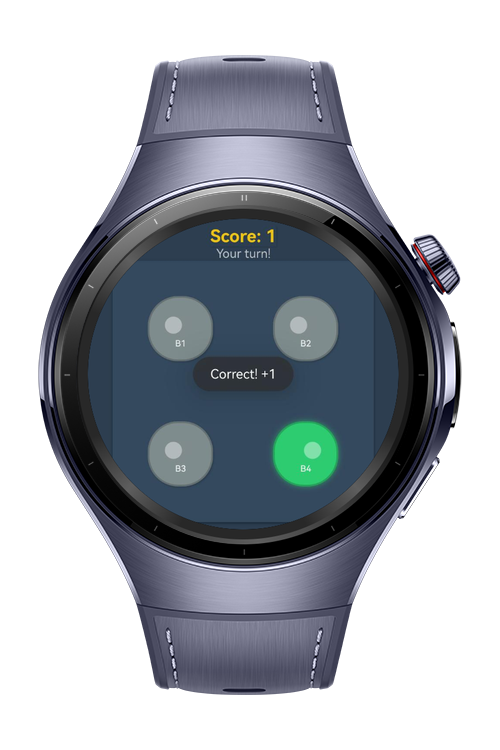
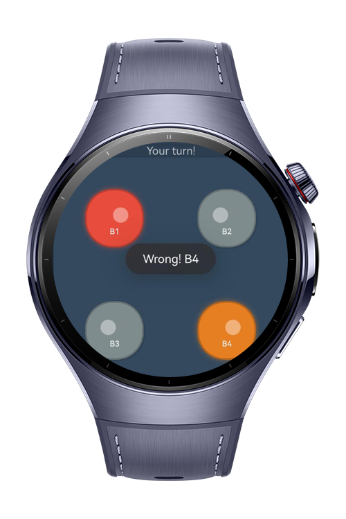

> **Note:** To access all shared projects, get information about environment setup, and view other guides, please visit [Explore-In-HMOS-Wearable Index](https://github.com/Explore-In-HMOS-Wearable/hmos-index).

# How to make Light Bulb Game

A simple memory game where players must remember and tap the correct light bulb.

# Preview

<div>
  
  
  
</div>

# Use Cases

Perfect for quick cognitive training, casual gaming, or testing short-term memory on small wearable screens.

# Features

- Randomly lights up one of four bulbs
- Player must remember and tap the correct bulb
- Score tracking system
- Minimalistic UI with toggle switches representing bulbs
- Toast notifications for immediate feedback

# Tech Stack

- **Languages**: ArkTS
- **Frameworks**: HarmonyOS SDK
- **Tools**: DevEco Studio
- **Libraries**: @kit.ArkUI

# Directory Structure

```entry/src/main/ets/
├── AppScope
│	├── app.json5
│	└── resources
│		└── base
│			├── element
│			│	└── string.json
│			└── media
│				├── app_background.png
│				├── app_foreground.png
│				└── app_layered_image.json
├── LICENSE
├── README.md
├── build-profile.json5
├── code-linter.json5
├── entry
│	├── build-profile.json5
│	├── hvigorfile.ts
│	├── obfuscation-rules.txt
│	├── oh-package.json5
│	└── src
│		├── main
│		│	├── ets
│		│	│	├── entryability
│		│	│	│	└── EntryAbility.ets
│		│	│	├── entrybackupability
│		│	│	│	└── EntryBackupAbility.ets
│		│	│	└── pages
│		│	│		└── Index.ets
│		│	├── module.json5
│		│	└── resources
│		│		├── base
│		│		│	├── element
│		│		│	│	├── color.json
│		│		│	│	├── float.json
│		│		│	│	└── string.json
│		│		│	├── media
│		│		│	│	├── background.png
│		│		│	│	├── foreground.png
│		│		│	│	├── layered_image.json
│		│		│	│	└── startIcon.png
│		│		│	└── profile
│		│		│		├── backup_config.json
│		│		│		└── main_pages.json
│		│		└── dark
│		│			└── element
│		│				└── color.json
│		└── mock
│			└── mock-config.json5
├── hvigor
│	└── hvigor-config.json5
├── hvigorfile.ts
├── oh-package.json5
└── screenshots
	└── Animation.gif
```

# Constraints and Restrictions

## Supported Devices
- Huawei Watch 5

# LICENSE

Light Bulb Game is distributed under the terms of the MIT License.  
See the [LICENSE](/LICENSE) for more information.
